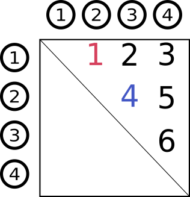
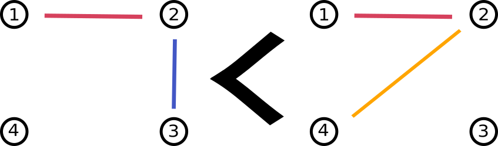
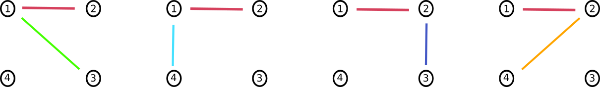
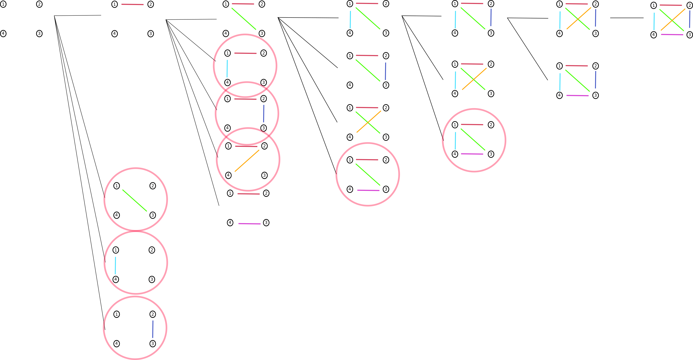

Implementation of orderly enumeration of graphs.

Edges are given an order. This is used to order the graphs and allows us to define canonicity via the smallest graph (the 'minimal' graph).
The main insight in this algorithm is that a minimal graph with k edges will have a k-1 sub graph that is also minimal. Thus we can enumerate by adding edges to only the minimal graphs.

## Limitations;

- Doesnt support any constraints.
- Tests all permutations to filter out isomers.
- Doesnt support parallel enumeration.
- Has a bug where some extra isomers are getting through.

## Background on the orderly enumeration of graphs

Our goal is to generate all chemical structures given a molecular formula, subject to some constraints. We define 'chemical structure' to mean the bonding structure of the molecule (ie the existence of bonds between atoms, not 'stereo' or the 3D information).

Graphs can be used to represent this bonding structure by equating the edges of a graph with chemical bonds [Bonchev 1991](https://books.google.co.nz/books?hl=en&lr=&id=X0AG7HhiccoC&oi=fnd&pg=PA1&dq=Chemical+Graph+Theory:+Introduction+and+Fundamentals+1st+edition++bonchev&ots=Rbwszc_diC&sig=snbS9Wz02RA29WXTyxnuAuQmCG4&redir_esc=y#v=onepage&q=Chemical%20Graph%20Theory%3A%20Introduction%20and%20Fundamentals%201st%20edition%20%20bonchev&f=false). So, now we have translated the problem of generating structures into generating graphs.

However, a problem that occurs when attempting to generate graphs is: generating the 'same' graph multiple times. How can we avoid this, efficiently?

A naive solution is to check whether the next graph is already in the set of generated graphs. If so, discard it, else, add it to the generated set.
However, this solution requires checking each graph against all the graphs generated so far. This is expensive!

A cheaper solution is; ordering and then enumerating the graphs. By generating the graphs in order, it is not possible to repeat the same graph. [Meringer 2010](http://nozdr.ru/data/media/biblio/kolxoz/Ch/ChCm/Faulon%20J.L.,%20Bender%20A.%20(eds.)%20Handbook%20of%20chemoinformatics%20algorithms%20(CRC,%202010)(ISBN%201420082922)(ISBN%201420082922)(O)(435s)_ChCm_.pdf#page=246)

#### Ordered edges

To order the graphs, we start by ordering the edges.

Each edge can be represented as a tuple of node indices, $(i, j)$. For example, the existence of the edge $(2, 3)$ indicates there is an edge between node 2 and node 3.

Given two edges, $e$, $e'$. We say that $e$ is less than $e'$ if;

$$
\begin{aligned}
e \le e': i < i' \lor (i = i' \land j < j')
\end{aligned}
$$

This can be visualised as an ordering on an adjacency matrix.

(an adjacency matrix is a matrix of size $n\times n$ - where n is the number of nodes. Where the $i, j$ th entry corresponds to an edge between the $i$th and $j$th node.)

#### Ordered graphs

Now that the edges have an order, we can order graphs. Each graph is ordered by asking;
given two graphs, $g, g'$, if we sort their edges (which we can do now that the edges can be ordered) and pair them up. Are the edges in $g$ always less than (or equal) to the edges in $g'$? However, this description is only intuitive.

More formally, for two graphs $g, g'$ we say that $g$ is less than $e'$ if;

$$
\begin{aligned}
&g < g':  \\
(\exists i < \text{min}(t, t')&: e_i < e_i' \land \forall j < i: e_j = e_j') \\
&\lor (t < t' \forall &j \leq t: e_j = e_j')
\end{aligned}
$$

As an example, consider the two graphs below. The first graph is smaller than the second since the edge $(2, 3)$ is smaller than $(2, 4)$.

#### Graph isomorphism

Aside: In what sense can two graphs be the 'same'?
Consider the four graphs shown below. They all have different edges, but are essentially the same graph: a graph with a 3-chain, and one disconnected node.

Formally, an isomorphism of graphs $G$ and $H$ is a bijection between the vertex sets of $G$ and $H$

$$
f\colon V(G)\to V(H)
$$

such that any two vertices $u$ and $v$ of $G$ are adjacent in $G$ if and only if $f(u)$ and $f(v)$ are adjacent in $H$.

#### Canonicity

Now that we have an order on the graphs, we can use this order to define the canonical graph (of a set of isomorphic graphs).
The canonical graph is defined to be the minimal graph. The minimal graph is defined to be the smallest graph is the set of all isomorphic graphs.

A graph, $g$ is said to be minimal if, for all permutations in the symmetric group $S_n$, $g$ is the smallest graph.

$$
\forall \pi \in S_n : g \leq g_\pi
$$

It is known that every minimal graph representative with $n$ edges has a minimal subgraph with $n-1$ edges [Read 1978](https://www.sciencedirect.com/science/article/abs/pii/S016750600870325X).
This means that as we construct graphs by adding edges, we only need to pay attention to the minimal graphs, the rest can be ignored as they are not canonical.

#### The orderly enumeration algorithm

Now we are ready to describe the orderly enumeration algorithm [Meringer 2010](http://nozdr.ru/data/media/biblio/kolxoz/Ch/ChCm/Faulon%20J.L.,%20Bender%20A.%20(eds.)%20Handbook%20of%20chemoinformatics%20algorithms%20(CRC,%202010)(ISBN%201420082922)(ISBN%201420082922)(O)(435s)_ChCm_.pdf#page=246).
As noted above, we only need to generate minimal graphs, the rest are not canonical.
So, we start with the smallest graph, a graph with no edges, and proceed by adding larger edges, in order.
As we add edges, we check whether the constructed graph is minimal, if it isn't, we discard it.
This process is visualised below.

